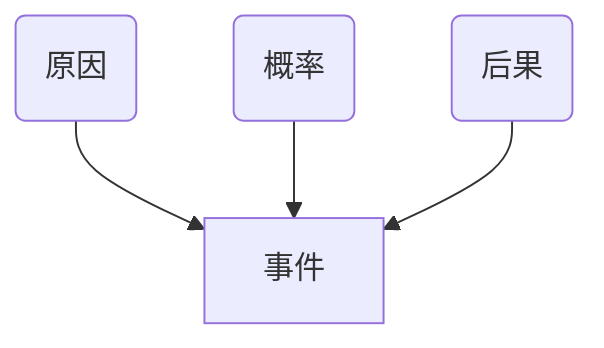

# 疫情防控下的项目管理

> 戴朝昕（圣略）


<!-- toc -->

## 1. 风险管理概述

### 什么是风险

- 一旦发生，会对一个或多个项目目标（如进度、成本、质量）产生正面或负面影响的不确定事件或条件

- **积极影响的风险是机会，消极影响的风险是威胁**（事物两面性：有危必有机）

- #### 案例：深圳某电子集团

  - 消极风险（威胁）：３月底钱，湖北籍和其他一些外地员工因为疫情，可能仍不能回厂，这将会导致公司３０％的订单无法完成。
  - 积极风险（机会）：３月底钱，同样有大量工人留在粤西、粤北、江西、广西地区，可以招临工。


### 避险与冒险

- 避险-保守自卑
- 合适-自信
- 冒险-激进自负

> 冒险与避险是对立统一的。有时候短期的冒险正是为了长期的避险，局部的冒险正是为了整体的避险。
>
> <p align="right">---- 任正非</p>


### 华为实施风险应对

- 2019年5月15日，美国总统特朗普签署行政令，要求美国进入紧急状态，美国企业不得供货和使用，对国家安全构成风险的中国企业所生产的电信设备，此举针对华为。

- #### 华为海思总裁何庭波

  - 多年前，公司做出了极限生存的假设，有朝一日所有先进芯片和技术将不可进口获得，而华为仍持续为客户服务。为此海思走上了科技史上最为艰辛的长征：为了公司的生存打造备胎。面对数以千计的科技难题，我们无数次失败过困惑过，但从来没有放弃过。今天，华为保密柜里的备胎芯片全部转正。这确保了公司大部分产品的战略安全，大部分产品的连续供应。
  - 战友们，奋斗就会有艰辛，然而艰辛却往往孕育着发展！


### 风险管理四要素



```
概率*后果=风险敞口
风险概率*风险影响=风险评分
```


### 疫情期间办理复工许可证的风险要素

- 风险起因：企业需要申领复工许可证
- 风险条件：公司不熟悉办证的申领程序
- 风险事件：许可证颁发可能延误


## 2. 风险识别与评估

### 风险管理三部曲


- 培训风险实例

| 风险                                         | 应对                         |
| -------------------------------------------- | ---------------------------- |
| 电脑坏了！推迟上课                           | 课前调研                     |
| 全省视频讲坛，领导都来了，老师迟到了         | 提前抵达                     |
| 老师讲课没有针对性，不符合需求               | 提前课件 |
| 课程半天，学员不满其偏激观点，终止课程       | 课前互动                   |
| 比赛项目，选手名字、宣传都错了。连夜赶工纠错 | 提前校对                     |
| 网络直播虽提前测试，但开始时出问题，延迟     | 课前调研                     |


###　1.风险识别

#### 各阶段典型风险事件


<span style="color:red"><u>**必须裁剪，风险登记册周期登记、更新 **</u></span>


####　案例：风险登记册


####　疫情期间企业面对那些风险

- 消极风险（威胁）：湖北籍员工不能返岗；供应商不能供货；客户欠款；4.4%-30%精力用于防控疫情，影响生产工作
- 积极风险（机会）：网上办公节约公司成本；有时间梳理公司流程和业务（公司保留核心业务，非核心业务则外包）；有时间学习和联通产业上下游；有时间网上培训，提升员工能力


###　2.风险评估

#### 风险概率影响矩阵


> 高风险：投入人财物资源应对；低中风险：记入待观察风险清单

#### 案列：项目风险分析表


#### 疫情期间企业面临的风险评分

- 消极风险（威胁）：湖北籍员工不能返岗；（影响-高0.4，概率-很高0.9，风险评分=0.4*0.9=0.36高风险）
- 积极风险（机会）：网上办公节约公司成本；（影响-高0.4，概率-很高0.9，风险评分=0.4*0.9=0.36高风险）


## 3.项目风险应对

<span style="color:red">**可打组合拳**</span>

#### 消极风险（威胁）应对策略

| 策略 | 内容                                                         | 应对                                                         |
| ---- | ------------------------------------------------------------ | ------------------------------------------------------------ |
| 上报 | 不在<span style="color:red">项目范围</span>内，或应对措施<span style="color:red">超出权限</span> | - 项目集层面<br />- 项目组合层面<br />- 整个项目层面<br />- 不在项目范围内<br />- 应对措施超出权限 |
| 规避 | <span style="color:red">改变</span>计划，<span style="color:red">完全消除</span>威胁 | - 取消某项工作<br />- 抢在雨季前完工<br />- 不用不可靠资源<br />- 改变项目计划<br />- 使目标不受威胁影响 |
| 转移 | 把风险影响和应对责任转移给第三方，<span style="color:red">支付风险费用</span> | - 购买保险<br />- 总价外包<br />- 要求提交担保<br />- 自制或外购分析<br />- 签订风险转移合同 |
| 减轻 | 减轻风险的<span style="color:red">概率和影响</span>          | - 设置警示标志<br />- 设置备用部件<br />- 使用优质供应商<br />- 降低概率<br />- 减轻后果 |
| 接受 | 接受，不采取任何措施。<span style="color:red">主动接受、被动接受</span> | - 能承受的威胁<br />- 无法用其他策略<br />- 列入观察清单<br />- 主动接受<br />- 被动接受 |


##### 案例：风险应对计划


##### 疫情期间风险应对

消极风险（威胁）：湖北籍员工不能返岗；（影响-高0.4，概率-很高0.9，风险评分=0.4*0.9=0.36高风险）

- 上报-向公司上报，寻求支援
- 规避-说服客服延期交货，或取消该项目
- 转移-部分工作外包，或购买保险
- 减轻(概率或影响)-招聘同行熟手；说服客户降低要求
- 接受-主动：储备一定人财物；被动：不做准备


#### 积极风险（威胁）应对策略

| 策略 | 内容                                                         | 应对                                                         |
| ---- | ------------------------------------------------------------ | ------------------------------------------------------------ |
| 上报 | 不在<span style="color:red">项目范围</span>内，或应对措施<span style="color:red">超出权限</span> | - 项目集层面<br />- 项目组合层面<br />- 整个项目层面<br />- 不在项目范围内<br />- 应对措施超出权限 |
| 规避 | <span style="color:red">确保</span>机会一定出现              | - 用新技术节约成本<br />- 用高能力人员提前完工<br />- 穷尽全部可能性<br />- 消除不确定性<br />- 确保肯定出现 |
| 提高 | <span style="color:red">提高</span>发生<span style="color:red">概率和影响</span> | - 更加努力学习<br />- 增加资源以提前完工<br />- 加强宣传<br />- 提高发生概率<br />- 扩大发生影响 |
| 减轻 | 把责任分配给有能力的第三方                                   | - 建立合作关系<br />- 组建联营体<br />- 成立特别公司<br />- 共担应对机会责任<br />- 共享机会发生利益 |
| 接受 | 不主动追求机会，出现时乐于利用                               | - 不大的机会<br />- 无法促使发生的机会<br />- 列入观察清单<br />- 不主动促使发生<br />- 乐意在发生时利用 |


##### 疫情期间风险应对

积极风险（机会）：网上办公节约公司成本；（影响-高0.4，概率-很高0.9，风险评分=0.4*0.9=0.36高风险）

- 上报-向公司上报有此机会：网上办公节约成本
- 开拓-投入技术资金、说服相关方保证实现该项目
- 提高（概率或影响）-加大宣传及时培训推广，增加资源
- 分享-与相关方分享经验和成果；成立项目或临时团队（虚拟团队）


