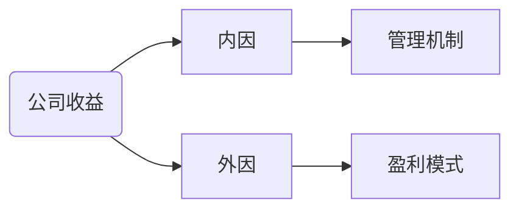
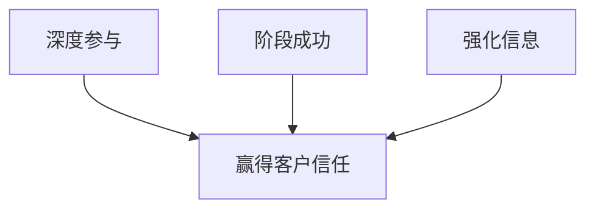

# 项目思维与管理关键之管理的残缺美

> 丁荣贵(工商管理学者之家)
>
> 视频链接：https://appxhwfzhkf8022.h5.xiaoeknow.com/content_page/eyJ0eXBlIjoxMiwicmVzb3VyY2VfdHlwZSI6NCwicmVzb3VyY2VfaWQiOiJsXzVlNmE0NmZmZDcwMTJfbU5Ec1ltTWgiLCJwcm9kdWN0X2lkIjoiIiwiYXBwX2lkIjoiYXBweEh3RnpIa2Y4MDIyIiwiZXh0cmFfZGF0YSI6MH0

[TOC]

> **VUCA时代：模糊性、不确定性、复杂性、易变性**

## 命题一：是盈利模式而不是管理，决定了企业的效益空间

### 管好“事”--盈利模式的重要性

管理出效益？利润中心？成本中心？

- 收益不是来至于勤奋，管好“事”

  三国演义，“凡天下大事” ”能攻心则反侧自消，从古知兵非好战；不审势即宽严皆误，后来治蜀要深思”

- 没有政治关系的保护，企业就是在裸奔

- 盈利模式需要通过降维以产生势能
- 管理需要与盈利模式匹配

### 盈利模式思考三个问题

- 赚谁的钱

- 为什么他们不得不花钱

- 为什么只能花给我

##　命题二：企业需要不断和客户联合创业

- 共同创造，共同分享

### 客户需求模糊，供需方角色纠缠

- 供需方角色纠缠(Role Entanglement)

  快速实现需求试探、确认、实现和迭代更新

### 供需角色的转变

### 从物理性的协作到化学性的协同

## 命题三：人才与矛盾共存

### VUCA时代，人力资源发生变化

虽有名马，祗辱于奴隶人之手，并死于槽枥之间，不以千里称也--韩愈 马说

飞鸟尽，良弓藏，狡兔死，走狗烹--史记 越王勾践世家

### 匹配和谐：人才对企业的价值

管理要针对人性

## 命题四：尊重人才但不能够依赖人才

### 私为公的基础，公为私的保障

- 员工：怎么考核就怎么做
- 人才的游牧方式与人才烂尾楼
- 企业不仁，员工不义
- 人工标准化-->体系自动化-->数据智能化：AI成为利益相关方
- "坏人"留给制度，"好人"留给自己

### 项目管理带动创新

- 运营+项目-->项目+运营
- 企业是经营项目的社区

## 命题五：项目管理人才大有可为

### 项目管理能力成为应对VUCA时代的核心能力

- 2019年64万PMP持证人，到2027年需求

- 人才是企业的流动资产
- 人才是项目的短期股东--区块连接口

## 提问：变革的浪潮中，我们的角色在哪里？

> **书推荐：**
>
> 管理者，而非MBA--明茨伯格
>
> 管理咨询的神话--马修·斯图尔德
>
> 重新定义公司--埃里克·施密特
>
> 重新定义战略--辛西娅·蒙哥马利
>
> 重新定义管理--布赖恩·罗伯逊
>
> 重新定义产品--金根培
>
> 重新定义创新--谢德荪

> **摘抄句子：**
>
> 只要信息不透明，都会往坏处想
>
> 管理讲求可控，一步一步实现
>
> 惊喜结果常常是惊吓
>
> 我们敢百分之百打包票：如果你有商业计划，那你的计划一定是错误的。只要是MBA式的商业计划，无论经过怎样的深思熟虑，一定在某些方面存在硬伤。--埃里克·施密特；乔纳森·罗森博格
>
> 若见诸相非相，即见如来--金刚经
>
> 虽有名马，祗辱于奴隶人之手，并死于槽枥之间，不以千里称也--韩愈 马说
>
> 飞鸟尽，良弓藏，狡兔死，走狗烹--史记 越王勾践世家