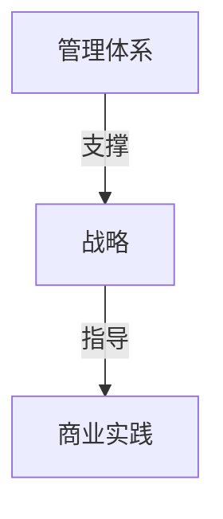
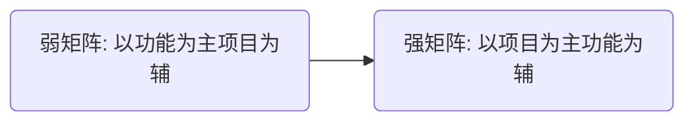
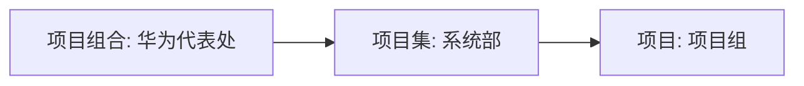
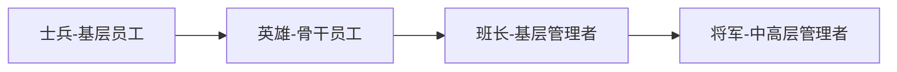

# 1. 华为项目管理概述

<!-- toc -->

## 1. 强底气，建设项目管理体系

>  组织级项目管理体系：项目本身的业务运作环节；支撑项目的管理系统，涉及授权、考核、评价与激励等方面。

### 1. 用项目组合管理价值

组织结构改变：

- **代表处：**客户组合和产品组合管理的主体，承担华为战略目标实现的责任，是经营单元。以<u>年度预算</u>为基础，在代表处层面优化资源配置，促进优质资源逐步向优质客户倾斜。
- **系统部：**项目集管理的主体，对经营目标的实现和客户满意度负责。
- **项目组：**项目管理的主体，基于契约开展优质、高效的交付，对交付进度、质量和客户满意等项目经营目标负责。

### 2. 推行项目概预核决，关注商业价值实现

<table>
    <tr>
        <td>阶段</td>
        <td>定义</td>
        <td>意义</td>
    </tr>
    <tr>
        <td><b>概算</b></td>
        <td>基于<u>设备、服务成本和相关成本</u>测算项目损益和现金流，80%的项目成本在概算阶段需要确定。设计项目利润的过程。</td>
        <td>设计项目利润的过程。</td>
    </tr>
    <tr>
        <td><b>预算</b></td>
        <td>基于<u>概算</u>，根据合同确定的交付承诺，结合交付计划和基线对项目执行周期内的收入、成本的现金流设定财务基准。</td>
        <td rowspan="2">管理增收节支的过程</td>
    </tr>
    <tr>
        <td><b>核算</b></td>
        <td><u>“温度计”</u>，准备地记录历史、描述现在，通过预测来管理未来。</td>
    </tr>
    <tr>
        <td><b>决算</b></td>
        <td>最后一次项目核算，项目关闭的<u>“秋后算账”</u>，通过经验教训总结改善后续运作，刷新基线。</td>
        <td>传承经验的过程</td>
    </tr>
</table>

### 3. 科学度量成熟度

三维度度量：组织、PMCoE(项目管理能力中心)、项目

- 组织级度量标准：

  - 初级：公司不具备或未使用项目管理技能
  - 推行：公司有基本的项目管理技能，偶尔使用，但不连贯，还处于开发过程中；
  - 运行：公司项目管理技能健全并全面运行，具有标准统一的流程；
  - 集成：公司项目管理技能娴熟实用，高度集成，在公司内持续使用，结果可预
    测；
  - 领先：公司项目管理技能达到世界领先水平，成为业界最佳实践。

  

- 度量 PMCoE 队伍的成熟度：

  - 战略理解力、业务理解力、趋势理解力，以及场景能力、管理体系能力和技术能力

  

  PMCoE 需要提供成功的变革项目、典型的交付方案、领先的能力框架、标杆的专家形象、持续的商业 计划书(BP)辅导和有效的评估基线。目的是：为实现建设一支专业、承重、追求卓越的专家队伍目标。

  

- 项目级度量：度量项目的健康程度

  - 工作和进度可预测，范围可实现、可管理，实现业务收益，项目相关方做出承诺，
    团队高绩效，风险可规避，项目财经管理良好

  

## 2. 聚人气，建设项目管理文化

**企业文化**是企业项目管理的重要支柱，它已成为公司的核心竞争力。

### 1. 华为项目管理的三种文化

####　理念文化

即公司价值观，项目管理价值观，高层领导的支持。

#### 制度文化

即规范的公司项目管理体系，明确的项目管理能力框架，匹配项目管理需要的组织架构。

#### 行为文化

即职业化的项目管理行为，卓越的领导力、战略和商业管理能力，健康的项目管理生态圈。

### 2. 华为项目管理文化的四个精髓

#### 以客户为中心

华为实行以客户为中心的作战方式，将支点建立在离客户最近的地方，让听得见炮声
的人来呼唤炮火。

#### 契约精神

- 契约精神的本质是一种双向的联系和规范，以立约方式确定人与人之间的互动关系。

- **立约**具体做法为：
  ①与公司立约，明确以项目为中心的政策、方法和流程，制定考核机制;
  ②与客户立约，“客户的信任要靠不断的艰苦奋斗得来。没有客户的支持、信任和压力，就没有华为的今天”;
  ③与员工立约，签订项目关键绩效指标(KPI)，实现高质量交付。

#### 结果导向

建立以结果为导向的**价值评价体系**，将项目<u> KPI 纳入个人绩效承诺书</u>，贯
彻结果导向，传递市场压力。同时，华为坚持以奋斗者为本，建立基于给客户、
上下游和团队带来的贡献和价值，以结果为导向的<u>任职资格制度</u>，使奋斗者获得
<u>合理的回报</u>。

#### 团队协同作战

实现客户、公司、团队和个人的共同发展，“胜则举杯相庆，败则拼死相救”的团队合作。

**狼性文化**，即目标一致、动作协同，同进同退、群狼众心，充分沟通、绝对服从，超强耐力、永不放弃。

### 3. 建立管理文化的模型及措施

#### 1. 模型：马斯洛需求层次理论

#### 2. 具体措施

- 理念文化：打通并建设分层分级的项目管理组织架构，建立和运营面向高
  层的持续汇报渠道，持续宣传项目管理文化，打造项目管理文化宣传周。
- 制度文化：建设四位一体的项目管理框架，运营并持续优化项目管理体系
- 行为文化：公司项目管理社区建设及运营，项目管理王牌课程开发及推广
  赋能，项目管理专刊的发行及专题研讨的开展，公司项目管理行业大会运作，确
  立各项评奖机制并持续运营。

## 3.鼓士气，培养项目管理人才

### 1. 人才成长路径

### 2. 发展路径的三个阶段

#### 1. 基层历练阶段

- 从最基层的项目做起，强调选拔，是从成功的实践产生。

- 先上战场，再建组织。

#### 2. 战训结合阶段

有管理潜力的人才通过基层实践选拔出来后，将进入实战与培训相结合的阶段，
此时华为会提供跨部门跨区域的岗位轮换和相应的赋能培训。

- 循环轮换

  - 关注干部的“之”字形成长
  - 人力资源部和片联负责选拔优秀的管理型人才进行循环轮换

  

- 赋能培训

  - 华为大学则负责赋能培训：华为大学通过短训赋能输出“能担当并愿意担当的人才”。“管事”和“管人”两个角度——青训班和一线管理者培训项目

  

#### 3. 理论收敛阶段

- 从基层到高层培养的阶段。
- 规定每位高级干部都必须参与华为大学的干部高级管理研讨项目。
- 高研班的主要目标：
  - 1、理解并应用干部管理的政策、制度和工具；
  - 2、更重要的是研讨华为核心战略和管理理念，传递华为管理哲学和核心价值观。