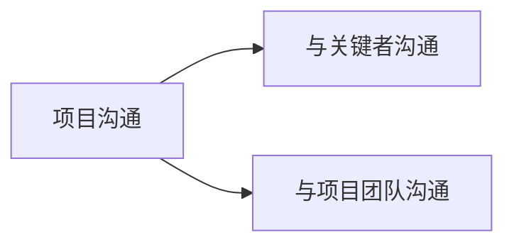
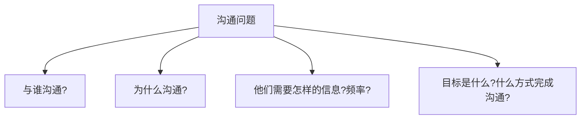

# 2. 华为项目管理的沟通之道 

<!-- toc -->

##　沟通渠道

###　1）基层战斗力最大化

- Project Leader的重要性：
  - PL素质影响基层战斗力，必须技能、管理两手抓。
  - PL有威望，基层才能舒心工作
- 基层民主：意见反馈渠道畅通

### 2）沟通技术

- 良好的沟通渠道可以减少内耗，让项目进行得更顺利
- 沟通渠道数量：N（N-1）/2
- 在项目组里，简化和梳理交流渠道也是非常重要的

## 1. 缺乏有效沟通，对项目是灾难性的 

- 有效沟通，项目沟通上所花的时间和精力对项目的成功有着决定性作用，它不仅造就了成功的项目经理，也造就了成功的项目。
- 有效的沟通是成功项目的典型特征之一。作为项目启动过程的一部分，项目核心
  团队应该撰写一份沟通计划。
- 有效沟通的程度对项目成功有着决定性的作用，使项目经理分为三类：
  - 普通项目经理--工程督导
  - 有效项目经理--实施经理
  - 成功项目经理--项目经理

## 2. 有效沟通的两大类别：关键者、项目团队 

### 1）与关键利益相关者沟通

####　沟通的思考问题

- 谁需要项目的信息？
- 他们需要项目的哪些信息？
- 他们需要信息的频率？
- 采用何种方式能够最有效地传递信息

#### 分享是沟通计划的关键输入变量

与关键利益相关者沟通的有效方式是为每一个相关者构建一个沟通矩阵。作为一个矩阵的一部分，团队决定谁将真正负责建立和执行沟通。

### 2）与项目团队沟通

#### 项目进展例会

- 频率适当：可以使团队在问题尚小之前能够发现和解决.
- 时长适当：时间短、强度高的项目，召开早晨的碰头会。站着开：鼓励就关键信息作简短扼要的报告。
- 非紧急事务：不能出乎意料。达成一致是目标，与其他工作相结合。

## 3.华为的沟通三原则 

### 1） 沟通及时

首要原则。华为员工会将必要的信息在第一时间向利益干系人传达，以保证上下、平行沟通渠道的顺畅。

### 2） 信息准确

华为员工沟通的第二原则。华为员工会借助金字塔思维工具，在金子塔顶端的是综述，即要表达的观点、问题、看法和结论。然后，华为员工会针对上一级的内容一层一层地展开，直到信息足够准确为止。

###　3） 严格控制信息传递的量

####  1. 信息量适当

过多倾听者容易忘记，过少则降低效率。

#### 2. 遵守 7±2 原理

记忆广度大约为 7 个单位（阿拉伯数字、字母、单词或其他单位）。

#### 3. 制定沟通计划

- 明确信息沟通的相关人、信息沟通形式、信息发放时间和发放方
  式等内容，并制定出详细的信息发放日程表。

- 明确两个层面：a)项目组内部沟通；b)与高层和顾客的沟通
- 明确四点问题：

## 4.人人必会的技能：学会倾听  

**三步骤：**备好纸笔、认真倾听、最终确认。

### 1. 备好纸笔

记录管理者的重要指示

### 2. 认真倾听

不仅会在任务记录单上标注关键词，偶尔还会有管理者当时的情绪状态词。

### 3. 最终确认

